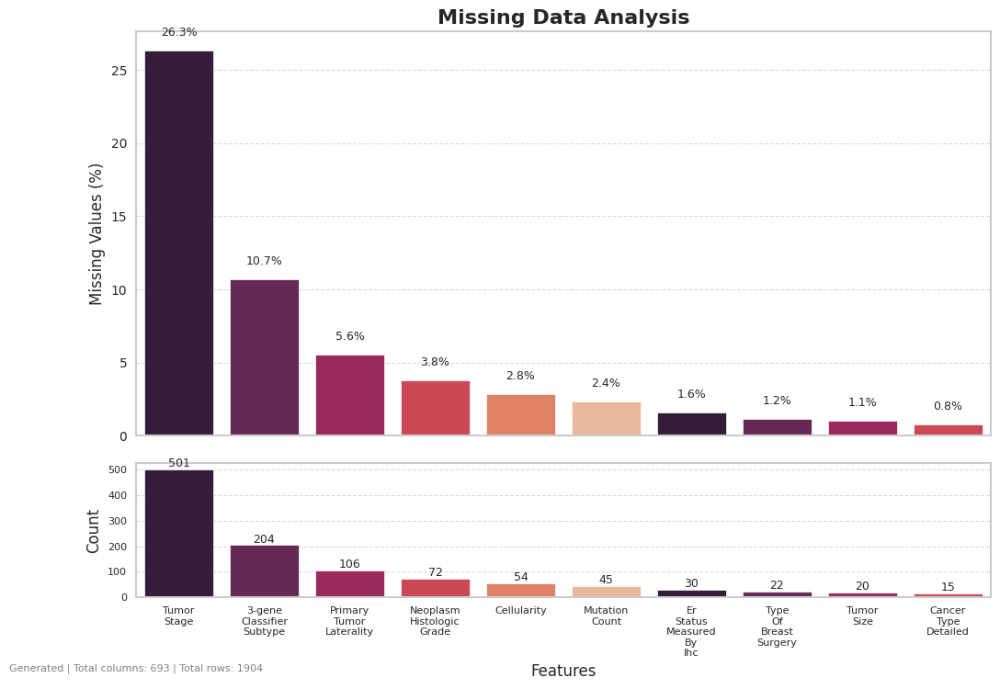
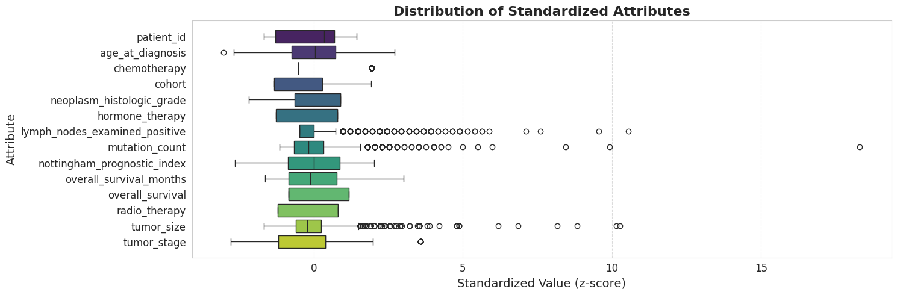
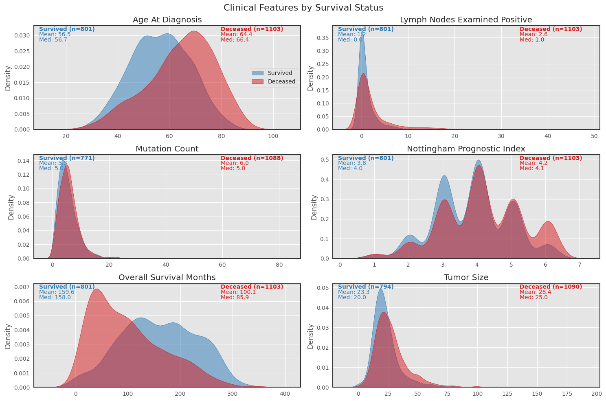

# Breast Cancer Gene Expression Analysis Toolkit

## Overview
A toolkit for analyzing breast cancer gene expression data, focusing on the relationship between clinical features, genetic markers, and patient outcomes. Provides functionality for data preprocessing, statistical analysis, machine learning modeling, and visualization of breast cancer datasets.

## Repository Structure

### Source Code (`src/`)
- **data.py**: Functions for loading, processing, and transforming breast cancer datasets, including Kaggle dataset integration and creation of specialized data subsets based on survival status, death cause, and treatment regimens.
- **preprocessing.py**: Data preprocessing utilities for handling missing values, standardization, and feature engineering.
- **statistical_analysis.py**: Statistical analysis tools for treatment effectiveness, clinical feature correlations, and survival outcome analysis.
- **models.py**: Machine learning models for predicting patient outcomes, including:
  - Basic classifiers (KNN, Logistic Regression, SVM, Decision Trees)
  - Ensemble methods (Random Forest, Extra Trees, AdaBoost)
  - XGBoost implementation with hyperparameter tuning
  - Model evaluation metrics and cross-validation
- **visualizations.py**: Comprehensive visualization functions for:
  - Clinical feature distributions by survival status
  - Missing data analysis
  - Standardized attribute distributions
  - Treatment Venn diagrams
  - Correlation heatmaps
  - Gene expression patterns
  - Model performance comparisons
- **utils.py**: Utility functions supporting the main modules

### Data Visualizations (`output/`)

*Analysis of missing data patterns in the breast cancer dataset*

*Distribution visualization of standardized clinical and genetic attributes*

*Comparison of key clinical features between surviving and deceased patients*

## Features
- Integration with Kaggle datasets for breast cancer research
- Comprehensive preprocessing pipeline for clinical and genetic data
- Statistical analysis of treatment effectiveness and survival outcomes
- Machine learning models for outcome prediction with cross-validation
- Visualization tools for data exploration and result interpretation
- Combined analysis of clinical features and genetic markers
